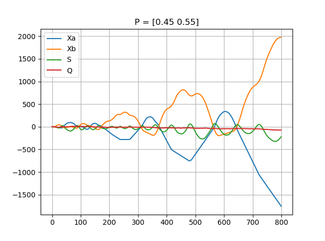
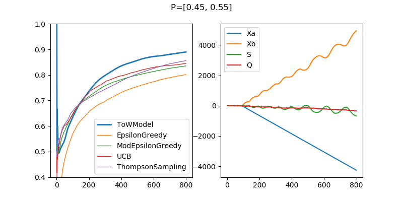
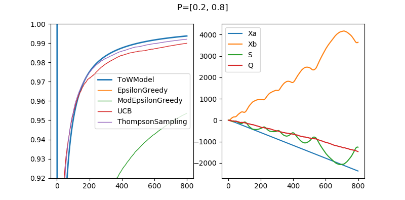

# Tag-of-War model for 2-Arm Bandit Problem
綱引きモデル





## citation
```
@article{KIM201029,
    title = "Tug-of-war model for the two-bandit problem: Nonlocally-correlated parallel exploration via resource conservation",
    journal = "Biosystems",
    volume = "101",
    number = "1",
    pages = "29 - 36",
    year = "2010",
    issn = "0303-2647",
    doi = "https://doi.org/10.1016/j.biosystems.2010.04.002",
    url = "http://www.sciencedirect.com/science/article/pii/S0303264710000559",
    author = "Song-Ju Kim and Masashi Aono and Masahiko Hara",
}
```