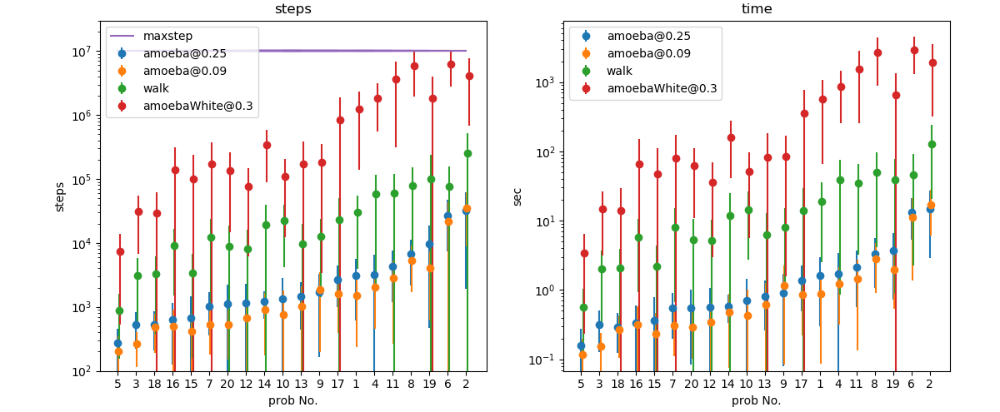
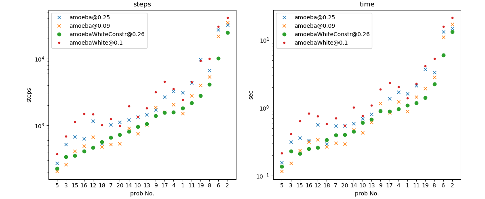
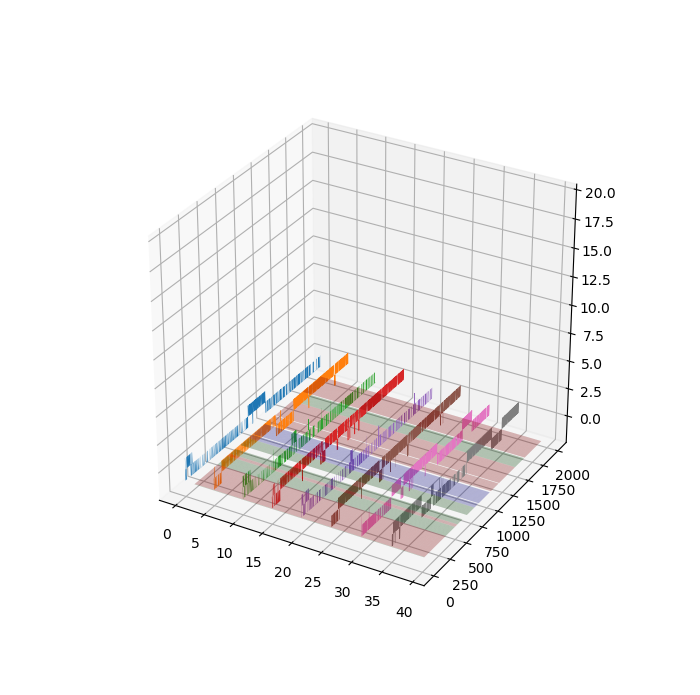

# SAT solver


## setup
[SATLIB](https://www.cs.ubc.ca/~hoos/SATLIB/benchm.html)からuf50-218をダウンロードしてフォルダをn50/にリネーム

## example
```
python eval.py   # 結構時間がかかる!
python eval_multiprocess.py    # eval.pyのマルチタスク版
python visualize.py    # eval*.pyで生成したcsvの可視化
```

## citation
```
@article{article,
    author = {Aono, Masashi and Kim, Song-Ju and Zhu, Liping and Naruse, Makoto and Ohtsu, Motoichi and Hori, Hirokazu and Hara, Masahiko},
    year = {2014},
    month = {01},
    pages = {586-589},
    title = {Amoeba-inspired SAT Solver},
    volume = {1},
    journal = {IEICE Proceeding Series},
    doi = {10.15248/proc.1.586}
}

@inproceedings{aono2014amoeba,
    title={Amoeba-inspired Heuristic Search for NP-complete Problem Solution at the Nanoscale},
    author={Aono, Masashi and Kim, Song-Ju and Kasai, Seiya and Miwa, Hiroyoshi and Naruse, Makoto},
    booktitle={Proceedings of the 2014 International Symposium on Nonlinear Theory and its Applications},
    pages={499--502},
    year={2014}
}

@article{Aono_2015,
	doi = {10.1088/0957-4484/26/23/234001},
	url = {https://doi.org/10.1088%2F0957-4484%2F26%2F23%2F234001},
	year = 2015,
	month = {may},
	publisher = {{IOP} Publishing},
	volume = {26},
	number = {23},
	pages = {234001},
	author = {M Aono and S Kasai and S-J Kim and M Wakabayashi and H Miwa and M Naruse},
	title = {Amoeba-inspired nanoarchitectonic computing implemented using electrical Brownian ratchets},
	journal = {Nanotechnology},
}
```

# Solution-searching
解が移り変わるやつ


```
python solution_search.py
```

## citation
```
@Article{Aono2015,
    author="Aono, Masashi
    and Wakabayashi, Masamitsu",
    title="Amoeba-Inspired Heuristic Search Dynamics for Exploring Chemical Reaction Paths",
    journal="Origins of Life and Evolution of Biospheres",
    year="2015",
    month="Sep",
    day="01",
    volume="45",
    number="3",
    pages="339--345",
    issn="1573-0875",
    doi="10.1007/s11084-015-9450-5",
    url="https://doi.org/10.1007/s11084-015-9450-5"
}
```